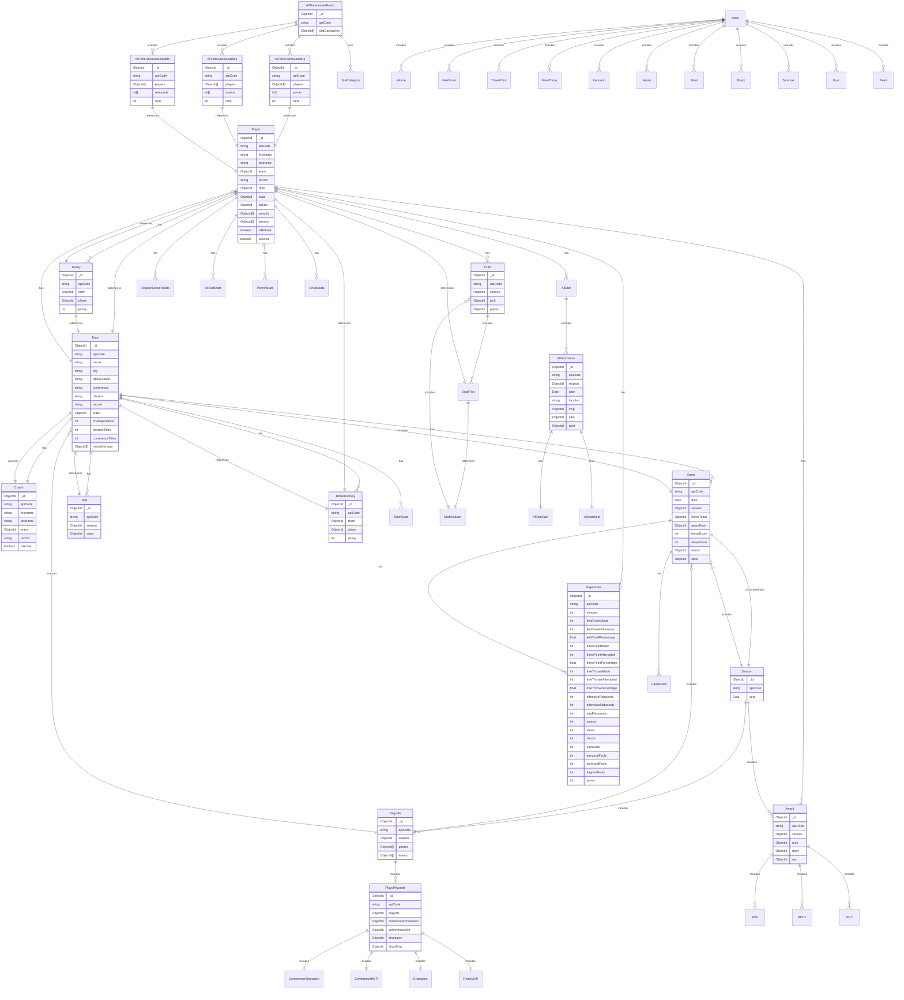

```mermaid
erDiagram
  Player {
    ObjectId _id
    string apiCode
    string firstname
    string lastname
    ObjectId team
    string record
    ObjectId draft
    ObjectId stats
    ObjectId allStar
    ObjectId[] awards
    ObjectId[] jerseys
    boolean isRetired
    boolean isActive
  }
  Team {
    ObjectId _id
    string apiCode
    string name
    string city
    string abbreviation
    string conference
    string division
    string record
    ObjectId stats
    int championships
    int divisionTitles
    int conferenceTitles
    ObjectId[] retiredJerseys
  }
  Coach {
    ObjectId _id
    string apiCode
    string firstname
    string lastname
    ObjectId team
    string record
    boolean isActive
  }
  Game {
    ObjectId _id
    string apiCode
    Date date
    ObjectId season
    ObjectId homeTeam
    ObjectId awayTeam
    int homeScore
    int awayScore
    ObjectId winner
    ObjectId stats
  }
  Season {
    ObjectId _id
    string apiCode
    Date year
  }
  Draft {
    ObjectId _id
    string apiCode
    ObjectId season
    ObjectId pick
    ObjectId player
  }
  PlayerStats {
    ObjectId _id
    string apiCode
    int minutes
    int fieldGoalsMade
    int fieldGoalsAttempted
    float fieldGoalPercentage
    int threePointMade
    int threePointAttempted
    float threePointPercentage
    int freeThrowsMade
    int freeThrowsAttempted
    float freeThrowPercentage
    int offensiveRebounds
    int defensiveRebounds
    int totalRebounds
    int assists
    int steals
    int blocks
    int turnovers
    int personalFouls
    int technicalFouls
    int flagrantFouls
    int points
  }
  AllTimeLeaderBoard {
    ObjectId _id
    string apiCode
    ObjectId[] statCategories
  }
  AllTimePointsLeaders {
    ObjectId _id
    string apiCode
    ObjectId[] players
    int[] points
    int rank
  }
  AllTimeAssistLeaders {
    ObjectId _id
    string apiCode
    ObjectId[] players
    int[] assists
    int rank
  }
  AllTimeReboundLeaders {
    ObjectId _id
    string apiCode
    ObjectId[] players
    int[] rebounds
    int rank
  }
  Award {
    ObjectId _id
    string apiCode
    ObjectId season
    ObjectId mvp
    ObjectId dpoy
    ObjectId roy
  }
  PlayoffAwards {
    ObjectId _id
    string apiCode
    ObjectId playoffs
    ObjectId conferenceChampion
    ObjectId conferenceMvp
    ObjectId champion
    ObjectId finalsMvp
  }
  Playoffs {
    ObjectId _id
    string apiCode
    ObjectId season
    ObjectId[] games
    ObjectId[] teams
  }
  AllStarGame {
    ObjectId _id
    string apiCode
    ObjectId season
    Date date
    string location
    ObjectId mvp
    ObjectId east
    ObjectId west
  }
  Title {
    ObjectId _id
    string apiCode
    ObjectId season
    ObjectId team
  }
  RetiredJersey {
    ObjectId _id
    string apiCode
    ObjectId team
    ObjectId player
    int jersey
  }
  Jersey {
    ObjectId _id
    string apiCode
    ObjectId team
    ObjectId player
    int jersey
  }

  Player ||--|| Team: "belongs to"
  Player ||--o{ PlayerStats: "has"
  Player ||--o{ Draft: "has"
  Player ||--o{ AllStar: "has"
  Player ||--o{ Award: "has"
  Player ||--o{ Jersey: "has"
  Player ||--o{ RegularSeasonStats: "has"
  Player ||--o{ AllStarStats: "has"
  Player ||--o{ PlayoffStats: "has"
  Player ||--o{ FinalsStats: "has"
  Team ||--o{ Player: "has"
  Team ||--|| Coach: "has"
  Team ||--o{ Game: "has"
  Team ||--o{ TeamStats: "has"
  Team ||--o{ Title: "has"
  Team ||--o{ RetiredJersey: "has"
  Coach ||--|| Team: "coaches"
  Season ||--o{ Game: "includes"
  Season ||--o{ Award: "includes"
  Season ||--o{ Playoffs: "includes"
  Game ||--|| Team: "involves"
  Game ||--o{ PlayerStats: "has"
  Game ||--o{ GameStats: "has"
  Game ||--|| Season: "associated with"
  AllTimeLeaderBoard ||--o{ StatCategory: "has"
  AllTimeLeaderBoard ||--o{ AllTimePointsLeaders: "includes"
  AllTimeLeaderBoard ||--o{ AllTimeAssistLeaders: "includes"
  AllTimeLeaderBoard ||--o{ AllTimeReboundLeaders: "includes"
  AllTimePointsLeaders ||--|| Player: "references"
  AllTimeAssistLeaders ||--|| Player: "references"
  AllTimeReboundLeaders ||--|| Player: "references"
  Draft ||--o{ DraftPick: "includes"
  DraftPick ||--|| Player: "references"
  DraftPick ||--|| DraftSeason: "references"
  DraftSeason ||--o{ Draft: "includes"
  Stats ||--o{ Minute: "includes"
  Stats ||--o{ FieldGoal: "includes"
  Stats ||--o{ ThreePoint: "includes"
  Stats ||--o{ FreeThrow: "includes"
  Stats ||--o{ Rebound: "includes"
  Stats ||--o{ Assist: "includes"
  Stats ||--o{ Steal: "includes"
  Stats ||--o{ Block: "includes"
  Stats ||--o{ Turnover: "includes"
  Stats ||--o{ Foul: "includes"
  Stats ||--o{ Point: "includes"
  Playoffs ||--o{ Game: "includes"
  Playoffs ||--o{ Team: "includes"
  Playoffs ||--o{ PlayoffAwards: "includes"
  AllStarGame ||--|| AllStarEast: "has"
  AllStarGame ||--|| AllStarWest: "has"
  AllStar ||--o{ AllStarGame: "includes"
  Award ||--o{ MVP: "includes"
  Award ||--o{ DPOY: "includes"
  Award ||--o{ ROY: "includes"
  PlayoffAwards ||--|| ConferenceChampion: "includes"
  PlayoffAwards ||--|| ConferenceMVP: "includes"
  PlayoffAwards ||--|| Champion: "includes"
  PlayoffAwards ||--|| FinalsMVP: "includes"
  Title ||--|| Team: "references"
  RetiredJersey ||--|| Player: "references"
  RetiredJersey ||--|| Team: "references"
  Jersey ||--|| Player: "references"
  Jersey ||--|| Team: "references"

```
